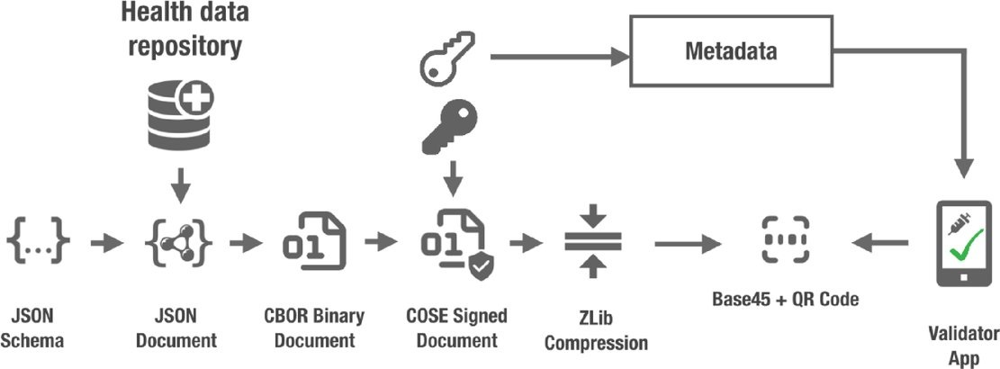

# Implementation of Acknowlegement for PDA1 request of PDA1.

Here we work on implementing the issuance and verification of a attestation which will contain the acknowledgement of the request for PDA1.

The attestation will take the for of a QR code in the same format as the EUDCC Covid Certificate, however containing the payload requered to give the receipt for the PDA1 and signed by the issuers stored in the 
EESSI_IR repository.

The following serialization will be implemented to create the QR code and allow verification: 

